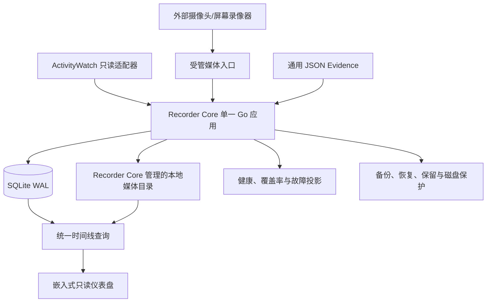

# 系统架构

## 1. Version 1 总体架构



Version 1 只有一个 Recorder Core 部署单元。外部采集器可以独立运行，但核心服务不拆成微服务，不内置录像器，也不包含 Python 或模型运行时。

## 2. 三层数据架构

### Evidence

原始、可回放、可重新分析的数据。Version 1 负责稳定保存和查询这一层。

### Observation

对证据的结构化观察，例如“检测到翻页”“检测到打开答案页面”。属于后续可选扩展，不是 Version 1 表或队列的交付要求。

### Inference

学习进度、掌握度、状态偏离等推断。属于后续研究范围，推断错误不得污染证据。

后续分析进程只能通过版本化的只读 Evidence 导出接口取数，并以带来源引用的版本化结果写回扩展存储。该接口可以在未来里程碑增加；Version 1 不提前实现分析 worker、任务队列或模型 schema。

## 3. 权威事实与可重建投影

为同时满足“仅追加证据”和高效查询，数据分为两类：

- 权威事实：`raw_events`、`collector_heartbeats`、媒体导入/身份/状态事件。业务内容只追加，不原地改写或覆盖。
- 可重建投影：采集器当前状态、媒体当前状态、覆盖区间、健康摘要和积压计数。允许事务性更新，但必须能从权威事实和明确配置重建。

任何投影更新失败不得删除权威事实。保留策略删除媒体本体时，元数据和删除状态事件仍保留。

## 4. 模块边界

### Recorder Core 最小核心

包含事件存储、本地 API、迁移、健康检查、配置和结构化日志。它们共同构成不可关闭的最小核心。

### 可独立关闭模块

- ActivityWatch 适配器
- 通用 JSON 导入器
- 媒体入口
- 覆盖率后台计算
- 只读仪表盘处理器
- 保留策略执行器
- 后续但不属于 Version 1 的分析接口

停用模块必须记录原因和时间。停用覆盖率计算不得影响权威事实写入；停用仪表盘不得影响 API；停用保留策略时仍保留磁盘关键水位保护。

### 外部采集器

ActivityWatch、FFmpeg 兼容录像器和未来其他采集器负责原始采集与自己的未确认数据缓存。Recorder Core 负责幂等接收、确认和健康暴露，不承诺替任意第三方进程保存尚未提交的数据。

## 5. 受管媒体导入边界

M2 已冻结的来源文件名、sidecar schema、确认、错误码和状态接口详见 [`MEDIA_INGEST.md`](MEDIA_INGEST.md)。

Version 1 只支持受管导入，不支持“登记一个可能被外部程序随时移动的任意路径”作为已接受证据。

1. 外部采集器完成分段后，发布媒体、版本化 sidecar 和就绪标记；仍在增长的文件不进入处理。
2. Recorder Core 验证字段和限制，将内容复制到目标存储同卷的临时文件，并在复制过程中计算校验和。
3. 大小、校验和、时长和时间范围通过后，在目标卷内原子改名。
4. 数据库事务追加媒体身份和 `accepted` 状态事件，然后向来源写确认标记。
5. 来源文件的清理由来源采集器在看到确认后负责；Recorder Core 默认不删除来源文件。

中断恢复使用来源幂等键、校验和和临时文件状态继续或安全重做。损坏文件进入受管隔离目录并保留原因；未知文件留在原处。

入口和目标根目录必须规范化；目的文件名由 Recorder Core 生成，sidecar 不能指定任意目标路径。Version 1 不跟随指向根目录外的符号链接、junction 或其他 reparse point。媒体时长/编码使用固定版本的 `ffprobe` 验证；工具缺失时媒体入口降级为不可用，其他 Evidence 继续接收。

## 6. 故障隔离

- 分析或云端不可用：Version 1 无依赖；后续扩展只报告 `disabled` 或积压
- 单个采集器失败：其他采集器和核心 API 继续运行
- 仪表盘失败：事件接收、媒体导入和运维脚本继续运行
- 覆盖率投影失败：保留权威事实，标记投影陈旧，稍后重建
- 数据库不可写：停止确认新写入，保留外部来源和本地临时文件，停止媒体删除
- 磁盘预警：关闭可选工作并暂停低优先级导入
- 磁盘关键：拒绝新媒体，优先保留数据库空间和故障记录，不删除未知数据
- 进程崩溃循环：有界重启后进入明确降级状态并按门槛通知

## 7. 技术选择

- Go：单一核心服务
- SQLite WAL：结构化权威事实与投影
- 本地文件系统：受管媒体、隔离区、临时文件和备份
- TypeScript：构建后嵌入 Go 二进制的只读前端
- PowerShell：Windows Task Scheduler 安装/卸载、测试、备份、恢复和回滚脚本
- ActivityWatch：桌面活动数据源
- FFmpeg 兼容分段：外部媒体来源

Python 只可能出现在 Version 1 之后的可选、隔离分析进程中。Version 1 不采用微服务、消息中间件、容器编排或必须联网的服务。

## 8. 建议目录结构

```text
.
├─ AGENTS.md
├─ README.md
├─ CHANGELOG.md
├─ go.mod
├─ go.sum
├─ cmd/
│  └─ exam-monitor/             # 唯一生产可执行程序入口
├─ internal/
│  ├─ app/                      # 启停、模块编排、降级
│  ├─ config/                   # 配置加载、默认值和校验
│  ├─ eventstore/               # 仅追加事件和幂等 API
│  ├─ mediaingest/              # sidecar、暂存、校验和隔离
│  ├─ collectors/               # ActivityWatch 与通用 JSON 适配
│  ├─ timeline/                 # 时间校正和确定性查询
│  ├─ coverage/                 # 可重建覆盖率投影
│  ├─ health/                   # 心跳、故障和资源状态
│  ├─ storage/                  # 水位、保留和空间预留
│  ├─ backup/                   # 备份与恢复核心逻辑
│  ├─ httpapi/                  # 本地 API 和只读查询
│  └─ platform/windows/         # Windows 服务与平台集成
├─ migrations/                 # 只前向、兼容上一稳定版回滚
├─ web/
│  ├─ src/                      # M5 TypeScript 源码
│  └─ dist/                     # 构建产物，由 Go embed
├─ configs/
│  └─ exam-monitor.example.json # 版本化 JSON；本机配置不提交
├─ scripts/                     # dev/test/smoke/build/install/... PowerShell
├─ tests/
│  ├─ integration/
│  ├─ smoke/
│  └─ faultinject/
├─ testdata/
│  ├─ events/
│  └─ media/
├─ docs/
├─ codex-prompts/
└─ data/                        # dev.ps1 的开发运行目录，不提交 Git
```

Windows 生产默认数据根是 `%LOCALAPPDATA%\ExamMonitor`；相对数据目录以该稳定根为基准，不能随 Task Scheduler 或命令行的工作目录漂移。Version 1 不创建 `analysis/`、`models/`、知识图谱服务或独立部署目录。未来确有里程碑时再增加，避免空接口演化成提前实现。
