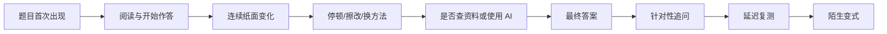

# 学习评估设计

> Version 1 边界：本文件只定义后续研究约束。M0-M6 不实现评估、追问、知识追踪或影子预测，也不为其提前建表/建队列。

## 1. 评估目标

判断考研知识点的：

- 覆盖度
- 练习量
- 当前表现
- 延迟保持度
- 迁移度
- 独立性
- 证据置信度

不得输出单一、虚假的“总掌握度”。

## 2. 证据链

## 3. 证据等级

- E0：数据不足
- E1：只有最终答案
- E2：观察到连续外显推导
- E3：受控环境下完成并通过追问
- E4：延迟复测和陌生变式均通过

## 4. 作答环境

每次尝试应记录：

- 时间和地点类别
- 睡眠和活动状态
- 环境噪声
- 中断次数
- 手机和电脑信息源使用
- 是否首次见题
- 是否刚看过讲解
- 是否使用提示

环境信息用于解释证据权重，不用于道德化评价。

## 5. 主动追问

当系统无法区分理解、记忆和猜测时，自动追问：

- 为什么该条件成立
- 若改变条件，哪一步失效
- 是否有另一种方法
- 关键概念的定义或适用边界

用户可以口头回答或继续纸笔作答，不要求填写日志。

## 6. 评估更新

正式评估由可解释的统计模型或知识追踪模型更新。视觉模型只生成结构化证据，不直接决定最终掌握度。

## 7. 影子模式

分析能力在正式影响计划前必须先运行影子模式：

- 产生预测
- 不修改学习计划
- 与未来真实表现对比
- 达到预设门槛后才允许上线
