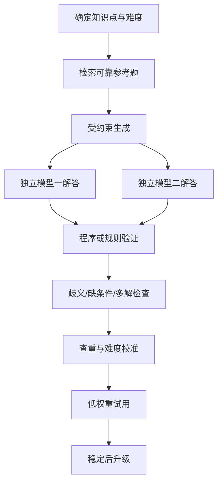

# 题目质量与主动测评

> Version 1 边界：题目分级、生成、验证和测评调度全部属于后续里程碑；Recorder Core 不实现题库业务。

## 1. 题目等级

### A 级

考研真题、官方样题。作为阶段测评和高权重锚点。

### B 级

可靠教材、主流习题集和经过人工验证的题库。作为日常练习主体。

### C 级

基于 A/B 级题受约束生成的变式题。用于迁移测试，必须经过验证。

### D 级

AI 自由生成题。只允许探索性练习，不能直接决定掌握度。

## 2. AI 题目验证流水线

## 3. 科目验证

- 数学：符号计算、数值抽样、边界和多解检查
- 数据结构：参考实现和随机测试
- 计组：状态模拟、位级校验
- 操作系统：调度和状态机模拟
- 计网：协议规则和报文推演
- 英语：真实语料、原文依据、答案唯一性和干扰项质量

## 4. 测评策略

- 学完后即时检验
- 次日短期保持
- 一周后延迟复测
- 后续陌生变式
- 高掌握节点降低频率
- 低掌握节点增加频率

## 5. 质量失败时降级

生成题不可靠时：

- 只从 A/B 级题库选择
- 暂停 C/D 级题
- 不影响记录和既有学习计划
