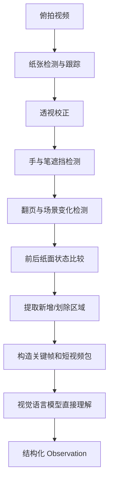

# 纸面视觉理解流水线

> Version 1 边界：整条视觉流水线均不实现。Recorder Core 只保存未来可重算的原始媒体和时间/来源元数据。

## 1. 主链路

## 2. 输入包

每个步骤可以包含：

- 题目区域高清图
- 书写前纸面
- 书写后纸面
- 新增笔迹高亮区域
- 划除区域
- 本步骤短视频
- 同期电脑和手机信息源事件
- 上一步结构化结果
- 相关教材或标准答案

## 3. 模型任务

### 行为理解

判断看题、写题、翻书、看答案、停顿、擦改和中断。

### 解题理解

判断知识点、方法、步骤作用、明显错误和最终结果。

### 独立验证

模型独立解题，再比较用户过程；必要时由第二模型复核。

## 4. OCR 的位置

OCR 仅用于：

- 搜索
- 粗索引
- 题号候选
- 公式片段辅助

模型不得因为 OCR 失败而丢弃原始视觉内容。
